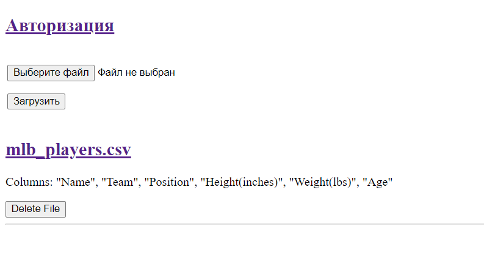

# Тестовое задание - HTTP-сервис для работы с csv файлами
Реализованы следующие функции:
- загрузка csv файлов
- получение списка файлов с информацией о колонках
- получение данных из конкретного файла с фильтрацией и сортировкой
- авторизация, регистрация, доступ к файлам только для авторизованных пользователей
- удаление файлов

  

По пути '/' доступен GET-запрос. Возвращаются все загруженные файлы с колонками. Есть возможность их удаления.
Также там можно загрузить новые файлы (только csv) и перейти на экран авторизации. Файлы хранятся в бд. Этот путь показывается для всх пользователей. Но удаление и загрузка - только для авторизованных.
По каждому файлу можно нажать и откроется страница с содержимым в виде таблицы. Там же есть сортировка и фильтрация.
Для этого нужно в соответствующие поля написать индексы колонок начиная с нуля через запятую. 
Для сортировки еще нужно, отступив пробел, перечислить True/False через запятую для колонок. True - по возрастанию, по умолчанию True.

По пути '/login' доступен POST-запрос. Можно авторизоваться, если данные есть в бд, иначе нужно зарегистрироваться.  
По пути '/register' доступен POST-запрос. Нужно ввести имя, пароль и почту. Каждое поле должно быть больше 3 символов.  
По пути '/profile' доступен GET-запрос. Сюда можно попасть, если, авторизовавшись, опять перейти на экран авторизации. Тут выводится имя и почта.
Если не авторизованный пользователь перейдет к конкретному файлу с корня, то его перебросит на экран авторизации и после нее обратно к этому файлу.

Для запуска нужно в папке проекта:

- создать изолированную среду ```python -m venv env```
- активировать ее ```source env/bin/activate``` на Linux или ```.\env\Scripts\activate``` на Windows
- установить зависимости ```pip install -r requirements.txt```
- запустить приложение ```python task.py```
- перейти в браузере по адресу http://localhost:5000/  

Или через Docker:
- скачать готовый образ ```docker pull dimanik115/test_task```
- запустить созданный на основе этого образа контейнер ```docker run -d -p 5000:5000 dimanik115/test_task```
- перейти в браузере по адресу http://localhost:5000/